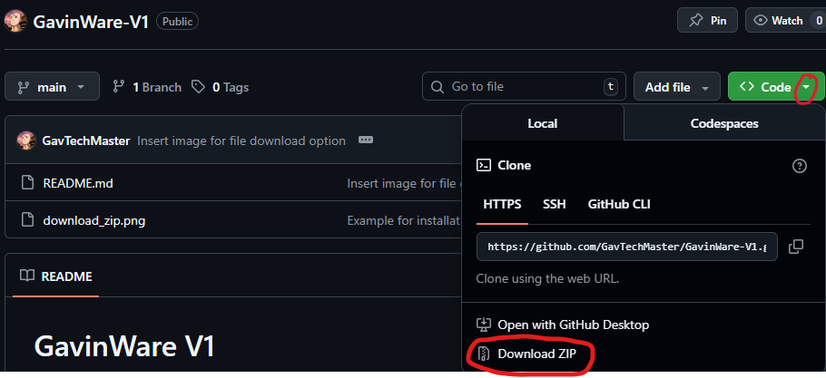

# GavinWare V1
A parody game of one of Nintendo/Intelligent System's popular games: WarioWare.<br>
#### DISCLAIMER, THIS GAME USES SOME COPYRIGHTED AUDIO FROM THE TITLES WarioWare: Mega Microgames, The Legend of Zelda: Breath of the Wild, Avatar: The Last Airbender, and The Legend of Korra Respectively. I do not claim any ownership of any of the audio used whatsoever.
## This game also uses a scoreboard: [GavTechMaster's Scoreboards](https://gavtechmaster.github.io)

## Controls:
W - Main Select Button<br>
S - Back or Cancel Button<br>
A - Button used in microgames<br>
D - Pause Button

## MOUSE IS NOT USED, USE ARROW KEYS INSTEAD

# Installation
## Windows
### Option 1: Terminal (If you have Git installed)
1. Open terminal (or Powershell), then go to a directory of your choosing.
2. Type the command:
```bash
git clone https://github.com/GavTechMaster/GavinWare-V1.git
```
### Option 2: File Explorer (If you don't have Git installed)
1. Download ZIP from GitHub

2. Extract it within your Downloads (or the directory you installed it in).
### Opening the file:
#### Option 1: File Explorer
1. Right click on the main.py file, then Open with > Python (or Open with > Choose another app > Python)

#### Option 2: Terminal
1. Open terminal (or Powershell) then type these commands:
```bash
# Make sure this is relative to you in CLI or make it an absolute path
cd GavinWare-V1-main
```
```bash
# Make sure you're inside the GavinWare directory or you are using an absolute path
python main.py
```
### If you don't have python installed:
1. Go to python.org, then go to Downloads > "Or get the standalone installer for Python 3.X.X"

2. On the installation screen, ADD PYTHON AS PATH!
## MacOS
### Option 1: Terminal (If you have Git installed)
1. Open terminal, then go to a directory of your choosing.
2. Type the command:
```bash
git clone https://github.com/GavTechMaster/GavinWare-V1.git
```
### Option 2: Finder (If you don't have Git installed)
1. Download ZIP from GitHub

2. Extract it within your Downloads (or the directory you installed it in).
### Opening the file:
#### Option 1: Finder
1. Double click on the main.py file, then open with Python.
#### Option 2: Terminal
1. Open terminal, then type these commands:
```bash
# Make sure this is relative to you in CLI or make it an absolute path
cd GavinWare-V1-main
```
```bash
# Make sure you're inside the GavinWare directory or you are using an absolute path
python3 main.py
```
### If you don't have python installed:
1. Go to python.org, then go to Downloads > "Download for macOS Python 3.X.X"

2. On the installation screen, ADD PYTHON AS PATH!
## Linux
### Terminal
1. Install git:
```bash
sudo apt update && sudo apt install git
```
2. Type this command to clone this respitory to you computer:
```bash
git clone https://github.com/GavTechMaster/GavinWare-V1.git
```
3. Go inside the GavinWare directory and add executable permissions to the main.py file:
```bash
cd GavinWare-V1-main
```
```bash
sudo chmod u+x main.py
```
4. Run the python file:
```bash
python3 main.py
```
### If you don't have python installed:
Type the commands:
```bash
sudo apt update
```
```bash
sudo apt install python3
```
